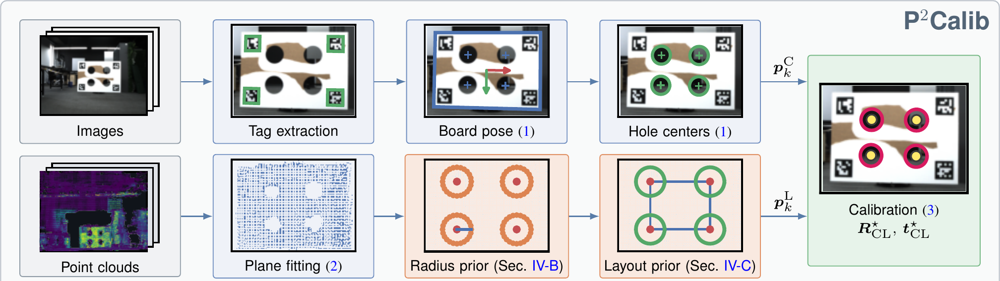
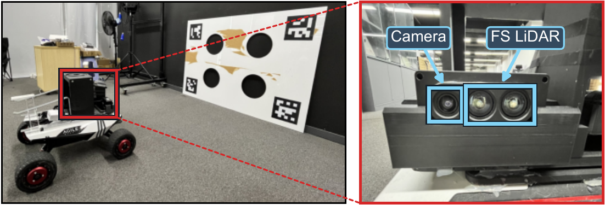
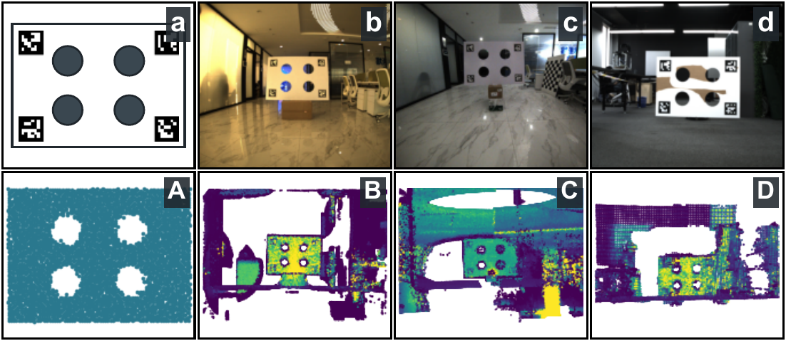
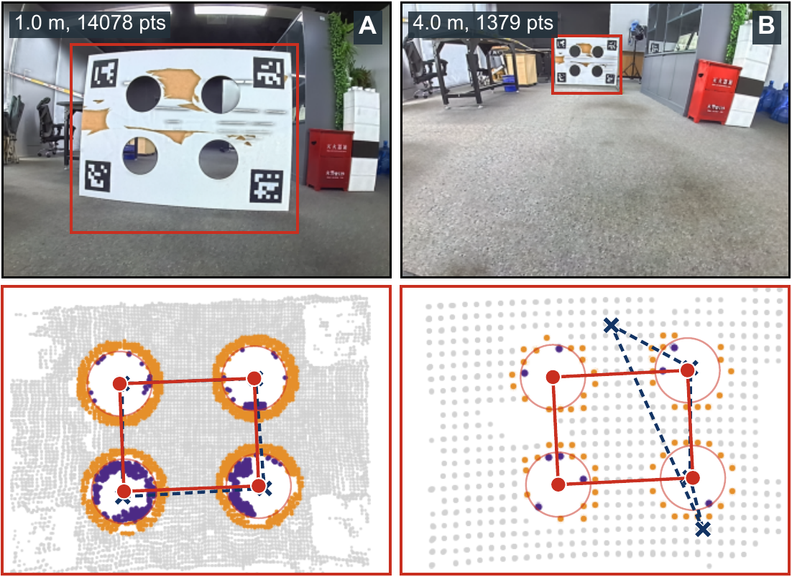
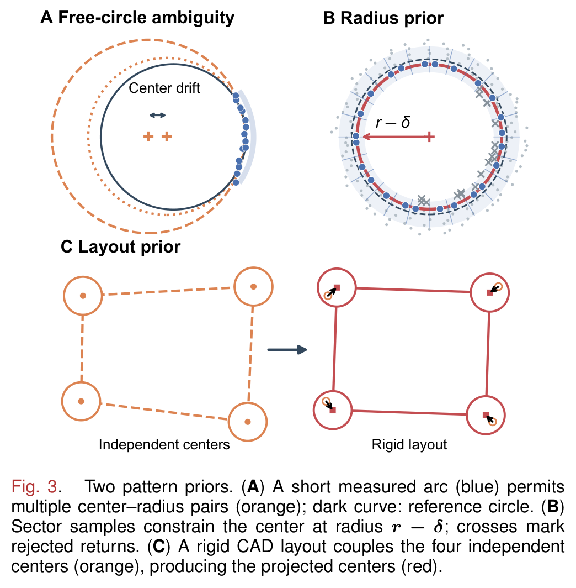
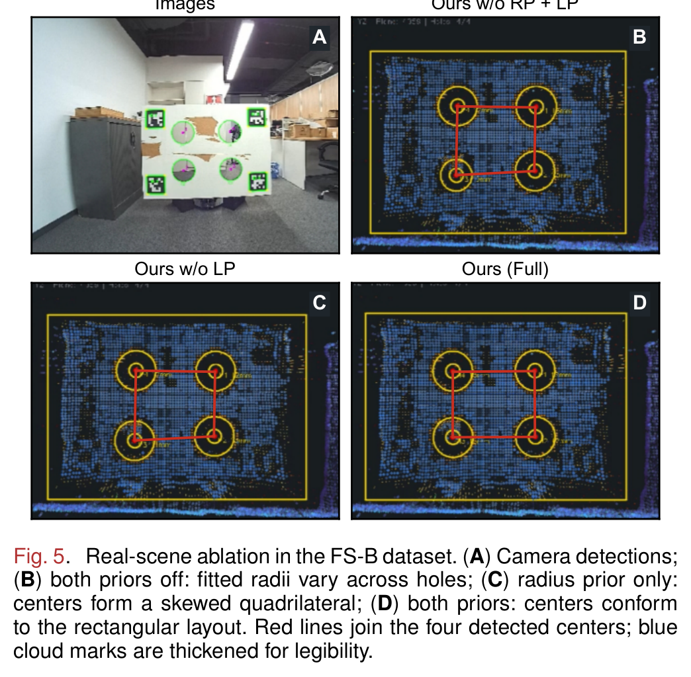
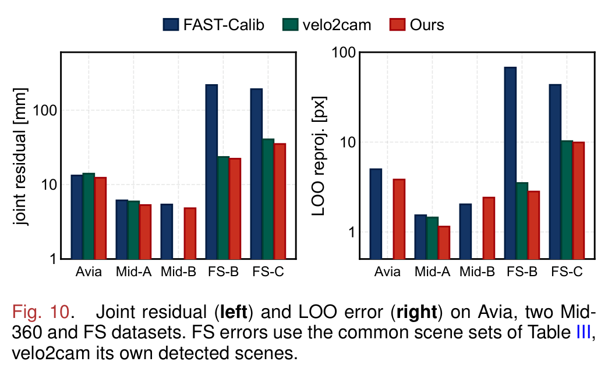

<div align="center">

<h1>P²Calib: Utilizing Pattern Priors for LiDAR–Camera Extrinsic Calibration</h1>


<a href="https://arxiv.org/"></a><a href="./README/p2calib_gui.mp4"></a><a></a>[](https://github.com/JokerJohn/P2Calib/stargazers)<a href="https://github.com/JokerJohn/P2Calib/network/members"></a>[](https://github.com/JokerJohn/P2Calib/issues)[](https://www.gnu.org/licenses/old-licenses/gpl-2.0.html)

*Whole-scene projection with the extrinsic of each method, on four sensors. White circles: image hole centers; red crosses: projected LiDAR centers.*

</div>

## Introduction

**P²Calib** calibrates a LiDAR and a camera from the four-hole board. Accuracy in this pipeline is limited by the LiDAR-side hole centers, which degrade under sparse angular coverage and mixed pixels. P²Calib removes this bottleneck with two **pattern priors** that the board's CAD model already specifies:

- **Radius prior** fixes the fitting radius to the CAD value, removing the center–radius degeneracy of short-arc circle fitting.
- **Layout prior** projects the four centers onto the known rigid rectangle, reducing the per-capture unknowns from twelve to four.
- **Results**: 90% / 82% lower joint residual and 96% / 77% lower held-out reprojection error on two real solid-state LiDAR datasets; 3.5–6.9× lower hole-center error in simulation.
- **Cost**: 4.5–6.3 ms per cloud. No initial extrinsic guess required.

<div align="center">



</div>

## News

- **2026/09/07**: Repository created; code, tool and datasets are being prepared for release.

## Hardware and Scenes

<div align="center">



</div>

*Mobile platform and calibration board, with the camera and the area-array LiDAR enlarged.*

<div align="center">



</div>

*One data source per column, camera image (**a–d**) above the range-shaded LiDAR scan (**A–D**), the holes appearing as white voids: (**a,A**) simulator, (**b,B**) Livox Avia, (**c,C**) Livox Mid-360, (**d,D**) area-array FS LiDAR.*

| Dataset | Sensor | Scenes | Standoff |
| ------- | ------ | -----: | -------- |
| `FS-B` | area-array solid-state LiDAR + 1920×1080 camera | 18 | 1.5–4.3 m |
| `FS-C` | area-array solid-state LiDAR + 1920×1080 camera | 20 | 1.0–4.2 m |
| `Avia` | Livox Avia | 5 | — |
| `Mid-360 A / B` | Livox Mid-360 | 4 / 3 | — |
| `Simulated` | four-hole board simulator | 60 frames × 2 densities | 1.5–5.0 m |

The area-array LiDAR has a 120°×50° field of view, 0.33° resolution in both axes, and ±50 mm range noise. `Avia` and `Mid-360` come from [FAST-Calib](https://github.com/hku-mars/FAST-Calib). Download links will be added on release.

## Interactive Calibration Tool

<div align="center">


</div>

*Batch detection and joint solving: sample rail on the left; camera and point-cloud views on top with the ROI, fitted rings and hole centers overlaid; reprojection view and run log below; workflow checklist on the right. Full recording: [`p2calib_gui.mp4`](./README/p2calib_gui.mp4).*

The workbench exposes every intermediate result, reports the layout disagreement and the registration residual separately for each capture, solves the included samples jointly, and exports the extrinsic, reprojection images, colored clouds and a run manifest.

## Method

<div align="center">



</div>

*Hole extraction without the priors, at 1.0 m (left) and 4.0 m (right), in the board plane. Mixed pixels (violet) and sparse boundary sampling (orange) displace the baseline centers (dashed) from the CAD rectangle, which P²Calib (solid) recovers.*

<div align="center">



</div>

*(**A**) A short arc (blue) permits many center–radius pairs (orange). (**B**) Sector samples constrain the center at radius r−δ; crosses mark rejected returns. (**C**) The CAD layout couples the four independent centers (orange) into the projected centers (red).*

Boundary candidates are drawn from an annulus and reduced to one representative per azimuth sector, then each center is solved by Huber-weighted Gauss–Newton against the fixed radius, where a single bias δ absorbs the inward rim erosion. The four refined centers are finally projected onto the CAD rectangle. Both priors act only on the LiDAR branch, so P²Calib is a drop-in replacement for the extraction stage of any four-hole pipeline.

## Results

Joint residual [mm] and leave-one-out reprojection error [px], lower is better. `Det.` counts successful extractions over five seeds; errors use the scenes every variant detects.

| Method | FS-B Det. | Joint | LOO | FS-C Det. | Joint | LOO |
| ------ | --------: | ----: | --: | --------: | ----: | --: |
| velo2cam¹ | 14/18 | 23.50 | 3.51 | 11/20 | 40.55 | 10.25 |
| FAST-Calib | 85/90 | 217.68 | 67.50 | 65/100 | 191.50 | 43.34 |
| Ours w/o LP | 90/90 | 24.02 | 3.35 | 85/100 | 36.82 | 10.61 |
| Ours w/o RP | 80/90 | **22.23** | 2.87 | 60/100 | 35.92 | **9.67** |
| **P²Calib** | 80/90 | 22.28 | **2.82** | 60/100 | **35.13** | 9.91 |

¹ On its own detected scenes, after adapting its input stage to solid-state clouds.

<div align="center">



</div>

*Real-scene ablation on FS-B. (**A**) Camera detections; (**B**) both priors off, the fitted radii vary across holes; (**C**) radius prior only, the centers form a skewed quadrilateral; (**D**) both priors, the centers conform to the rectangular layout.*

<div align="center">



</div>

*Joint residual (**left**) and LOO error (**right**) on Avia, two Mid-360 sessions and the two FS datasets. Gains are smaller on scanning LiDARs, which already cover the hole rims densely.*

In simulation the hole-center error falls from 6.8–14.7 mm to 1.6–3.9 mm across all standoff groups, and the LOO reprojection error from 2.61 to 0.40 px on single-frame clouds and from 1.51 to 0.23 px on accumulated clouds.

<div align="center">


</div>

*Hole-center error against (**A**) standoff distance, (**B**) board placement in the image and (**C**) range-noise σ, on a shared logarithmic scale; AC solid, SF dashed. A curve ends where the method recovers no board.*

## Getting Started

> The calibration tool is being prepared for release. The commands below describe the released package.

Requires Ubuntu 20.04/22.04, Python 3.10, Open3D 0.19, OpenCV 4.10, PySide6, NumPy < 2.

```bash
git clone https://github.com/JokerJohn/P2Calib.git
cd P2Calib
scripts/setup_p2calib_env.sh     # conda environment
scripts/run_p2calib_gui.sh       # launch the workbench
```

One sample is one image paired with one point cloud; no rosbag is read.

```text
dataset_root/
  samples/scene_01/{image.png, cloud.pcd, meta.json}
  camera_intrinsics.yaml
  board_config.yaml              # circle_radius, hole spacing, marker size
```

Open the dataset, draw the LiDAR ROI once per scene, run `Detect Selected`, then `Optimize Included` for the multi-scene solve and `Export Result`. The two priors are independent switches, which reproduces every variant in the table above:

| `use_circle_prior` | `use_rect_template` | Variant |
| --- | --- | --- |
| `false` | `false` | FAST-Calib baseline |
| `true` | `false` | Ours w/o LP |
| `false` | `true` | Ours w/o RP |
| `true` | `true` | **P²Calib** |

## TODO

- [ ] Release the calibration tool and the four-hole simulator
- [ ] Release the FS-B and FS-C datasets
- [ ] Support multi-circle and non-rectangular board layouts
- [ ] Allow a signed rim bias for sensors with outward radius error

## Citation

```bibtex
@article{hu2026p2calib,
  title   = {P$^2$Calib: Utilizing Pattern Priors for LiDAR-Camera Extrinsic Calibration},
  author  = {Hu, Xiangcheng},
  journal = {arXiv preprint},
  year    = {2026}
}
```

The board and the baseline pipeline follow FAST-Calib and velo2cam:

```bibtex
@article{zheng2026fastcalib,
  title   = {{FAST-Calib}: {LiDAR}-Camera Extrinsic Calibration in One Second},
  author  = {Zheng, Chunran and Zhang, Fu},
  journal = {IEEE Robotics and Automation Practice},
  volume  = {1}, pages = {108--112}, year = {2026},
  doi     = {10.1109/RAP.2026.3692446}
}

@article{beltran2022automatic,
  title   = {Automatic Extrinsic Calibration Method for LiDAR and Camera Sensor Setups},
  author  = {Beltr{\'a}n, Jorge and Guindel, Carlos and de la Escalera, Arturo and Garc{\'i}a, Fernando},
  journal = {IEEE Transactions on Intelligent Transportation Systems},
  volume  = {23}, number = {10}, pages = {17677--17689}, year = {2022}
}
```

## Acknowledgment

- The pipeline is built on [FAST-Calib](https://github.com/hku-mars/FAST-Calib), whose GPL-2.0 license this project inherits, and which also provides the Avia and Mid-360 datasets used for the cross-sensor evaluation.
- The four-hole board design originates from [velo2cam_calibration](https://github.com/beltransen/velo2cam_calibration), which also serves as one of our baselines.
- Shenzhen Fushi Technology Co., Ltd. provided the area-array LiDAR, the mobile platform and the FS datasets.
- Shiyang Chen of X Square Robot contributed productive discussions on the prior formulation.
- The tool is built with [Open3D](https://github.com/isl-org/Open3D), [OpenCV](https://github.com/opencv/opencv) and [PySide6](https://doc.qt.io/qtforpython/).

## Contributors

<a href="https://github.com/JokerJohn/P2Calib/graphs/contributors">
  
</a>
