<div align="center">

<h1>P²Calib: Utilizing Pattern Priors for LiDAR–Camera Extrinsic Calibration</h1>

<p><a href="https://github.com/JokerJohn"><b>Xiangcheng Hu</b></a></p>

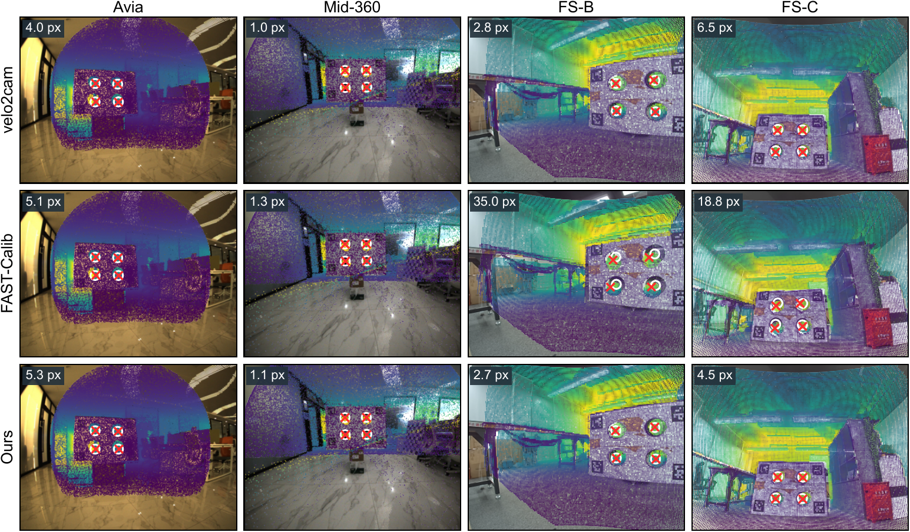

<a href="https://arxiv.org/abs/2609.07516/"></a><a href="./README/p2calib_gui.mp4"></a><a></a>[](https://github.com/JokerJohn/P2Calib/stargazers)<a href="https://github.com/JokerJohn/P2Calib/network/members"></a>[](https://github.com/JokerJohn/P2Calib/issues)[](https://opensource.org/licenses/MIT)

</div>

## Introduction

**P²Calib** calibrates a LiDAR and a camera from the four-hole board. Accuracy in this pipeline is limited by the LiDAR-side hole centers, which degrade under sparse angular coverage and mixed pixels. P²Calib removes this bottleneck with two **pattern priors** that the board's CAD model already specifies:

- **Radius prior.** The known hole radius is incorporated as a fitting constraint, which prevents the center estimates from degrading under sparse angular coverage.
- **Layout prior.** Building on the improved hole estimates, the rigid rectangular layout of the four holes is enforced as a global consistency constraint, which corrects the residual errors across holes.
- **Interactive tool.** Both priors are integrated into a calibration tool that provides a complete extrinsic calibration pipeline.

Experiments on simulated and real datasets show that P²Calib lowers the joint registration residual by 90% and 82% and the held-out reprojection error by 96% and 77% over the baseline.
<div align="center">

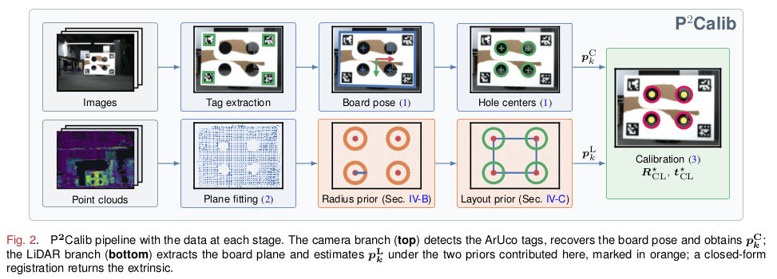

</div>

## News

- **2026/09/07**: Repository created; code, tool and datasets are being prepared for release.

## Hardware and Scenes


| 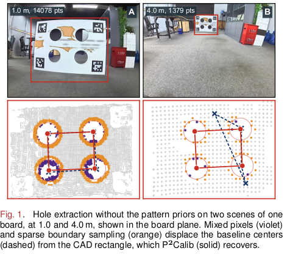 | 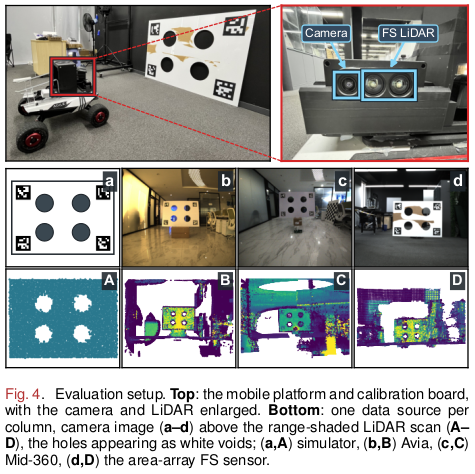 |
| ------------------------------------------------------------ | ------------------------------------------------------------ |

<div align="center">

| Dataset | Sensor | Scenes | Standoff |
| ------- | ------ | -----: | -------- |
| `FS-B` | area-array LiDAR | 18 | 1.5–4.3 m |
| `FS-C` | area-array LiDAR | 20 | 1.0–4.2 m |
| `Avia` | Livox Avia | 5 | — |
| `Mid-360 A / B` | Livox Mid-360 | 4 / 3 | — |
| `Simulated` | four-hole board simulator | 60 × 2 densities | 1.5–5.0 m |

</div>

The area-array LiDAR has a 120°×50° field of view, 0.33° resolution in both axes, and ±50 mm range noise. `Avia` and `Mid-360` come from [FAST-Calib](https://github.com/hku-mars/FAST-Calib). Download links will be added on release.

## Interactive Calibration Tool

<div align="center">

<a href="./README/p2calib_gui.mp4">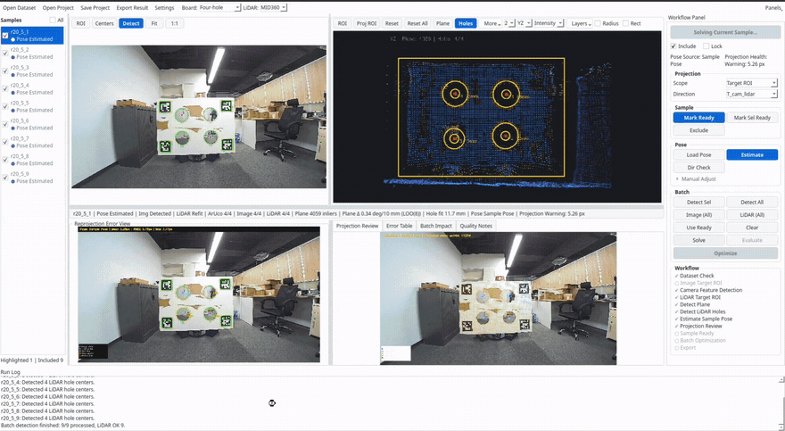</a>

</div>

Click the image to play the full demo. The tool shows every step live, reports per-scene residuals, solves the selected scenes jointly, and exports the extrinsic, reprojection images and colored point clouds.

## Method

| 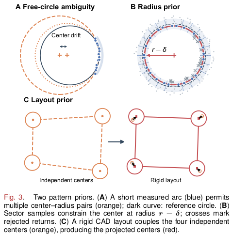 | 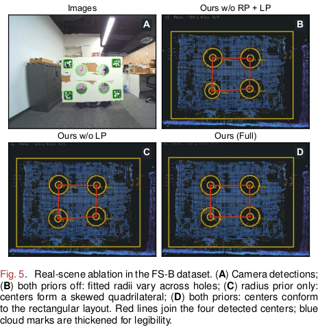 |
| ------------------------------------------------------------ | ------------------------------------------------------------ |

**Radius prior.** Each hole's radius is pinned to the known value `r − δ` instead of left free. That removes the center/radius trade-off in panel A above — with the radius fixed, a short arc can no longer be explained away by shrinking the circle instead of moving the center:

<div align="center">

$$
e_{ik} = d_{ik} - (r - \delta)
$$

</div>

> A free circle has 3 unknowns (center + radius), so four holes carry 12. The radius prior drops that to 4 × 2 + 1 = 9 by sharing one bias δ across holes; the layout prior below then collapses all eight center coordinates to the rectangle's 3 pose parameters, for 3 + 1 = 4 total. Same number of boundary points, far fewer parameters to explain them with — that's what makes the fit well-posed again on sparse data:

<div align="center">

$$
\underbrace{4 \times 3}_{12} \ \xrightarrow{\text{radius prior}}\ \underbrace{4 \times 2 + 1}_{9} \ \xrightarrow{\text{layout prior}}\ \underbrace{3 + 1}_{4}
$$

</div>

**Layout prior.** The four centers found this way are then snapped onto one rigid rotation and translation of the CAD rectangle, so a noisy hole gets pulled back into line by the other three instead of being trusted on its own:

<div align="center">

$$
(\theta^\star, t^\star) = \arg\min_{\theta,\ t} \sum_{k=1}^{4} \left\| \hat{c}_k - R(\theta)\,c^{\mathcal{B}}_k - t \right\|^2
$$

</div>


## Results


| 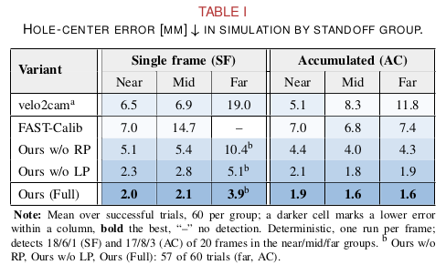 | 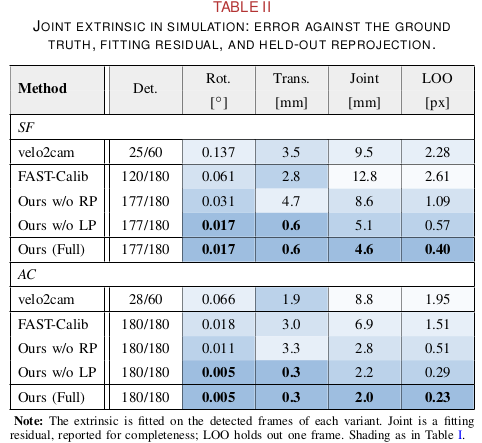 |
| ------------------------------------------------------------ | ------------------------------------------------------------ |
| 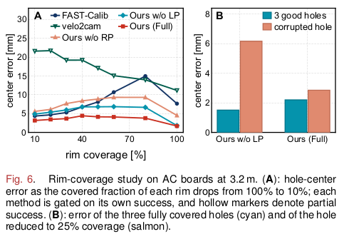 | 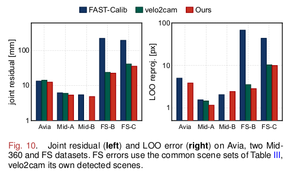 |

| 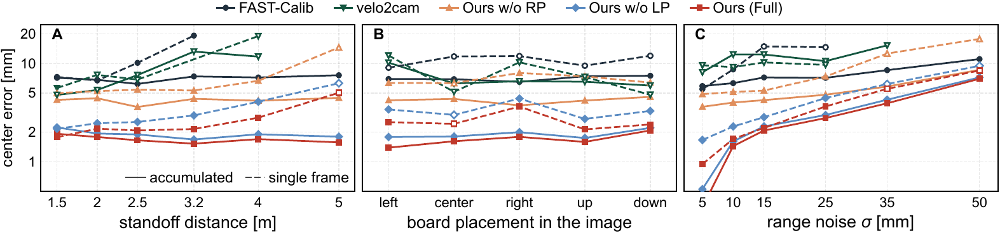                               |
| ------------------------------------------------------------ |
| 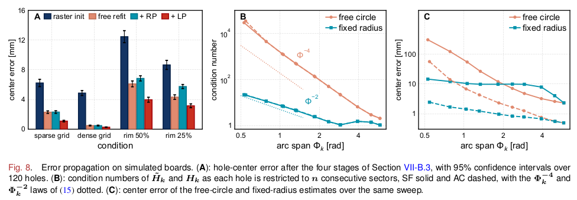 |


## Getting Started

P²Calib is implemented in Python, for Ubuntu 20.04/22.04, Python 3.10, Open3D 0.19, OpenCV 4.10, PySide6 and NumPy < 2.

```bash
git clone https://github.com/JokerJohn/P2Calib.git
cd P2Calib
scripts/setup_p2calib_env.sh     # conda environment
scripts/run_p2calib_gui.sh       # launch the workbench
```

Each sample is one image paired with one point cloud. Open a dataset, draw the LiDAR ROI once per scene, run `Detect Selected`, then `Optimize Included` for the multi-scene solve and `Export Result`. The two priors are independent switches, which reproduces every variant in the results table above:


## TODO

- [ ] Release the calibration tool and the four-hole simulator
- [ ] Release the FS-B and FS-C datasets
- [ ] Support multi-circle and non-rectangular board layouts
- [ ] Allow a signed rim bias for sensors with outward radius error

## Citation

```bibtex
@article{hu2026p2calib,
  title         = {P$^2$Calib: Utilizing Pattern Priors for LiDAR-Camera Extrinsic Calibration},
  author        = {Hu, Xiangcheng},
  journal       = {arXiv preprint arXiv:2609.07516},
  eprint        = {2609.07516},
  year          = {2026}
}
```

The board and the baseline pipeline follow [FAST-Calib](https://github.com/hku-mars/FAST-Calib) and [velo2cam_calibration](https://github.com/beltransen/velo2cam_calibration).

## License

P²Calib is released under the [MIT license](./LICENSE). 

## Acknowledgment

We thank the [FAST-Calib](https://github.com/hku-mars/FAST-Calib) and [velo2cam_calibration](https://github.com/beltransen/velo2cam_calibration), whose board and pipeline this work builds on; to Shenzhen Foreseen Technology for the area-array LiDAR, platform and FS datasets; and to Shiyang Chen of X Square Robot for insightful discussions.

## Contributors

<a href="https://github.com/JokerJohn/P2Calib/graphs/contributors">
  
</a>
